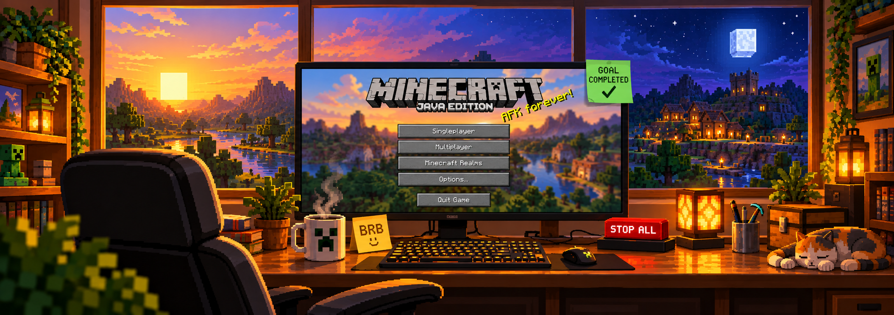

# Minecraft AFK



Bienvenido a Minecraft AFK. Si usas una granja de ataques o un generador de piedra y quieres controlar las acciones repetitivas desde una ventana, aquí encontrarás una herramienta para hacerlo. Puedes ajustar los ataques, preparar una sesión de minado, estimar el consumo de tu pico y consultar lo que está ocurriendo sin tener que recordar comandos. La interfaz está disponible en español e inglés y guarda tus ajustes para la próxima vez.

Esta guía te acompaña desde la instalación hasta tu primera ejecución. Si acabas de llegar, empieza por [los requisitos](#antes-de-empezar) y sigue [la instalación paso a paso](#instalar-y-abrir-la-aplicación). Cuando tengas la ventana abierta, continúa con [tu primera ejecución](#tu-primera-ejecución). Si algo no funciona como esperabas, al final encontrarás soluciones a los problemas más habituales y dónde pedir ayuda.

## Tabla de contenidos

Cada sección responde a una tarea concreta. Puedes seguir el orden de la guía la primera vez y utilizar este índice para volver directamente a lo que necesites después.

| Tema | Qué encontrarás |
| --- | --- |
| [Conocer la aplicación](#conocer-la-aplicación) | Para qué sirve cada pestaña y cómo se organiza el uso diario. |
| [Antes de empezar](#antes-de-empezar) | Sistema, dependencias y tipo de sesión gráfica necesarios. |
| [Instalar y abrir la aplicación](#instalar-y-abrir-la-aplicación) | Pasos y comandos para llegar a la ventana principal. |
| [Abrirla de nuevo](#abrirla-de-nuevo) | Cómo iniciar la aplicación una vez instalada. |
| [Tu primera ejecución](#tu-primera-ejecución) | Preparar Minecraft, elegir una granja y detenerla al terminar. |
| [Usar Mob Farm](#usar-mob-farm) | Configurar el intervalo entre ataques automáticos. |
| [Usar Stone Farm](#usar-stone-farm) | Elegir el pico, ajustar la durabilidad y utilizar el temporizador. |
| [Calibrar tu granja](#calibrar-tu-granja) | Medir el consumo real y guardar una referencia para el minado. |
| [Cambiar el idioma](#cambiar-el-idioma) | Elegir español, inglés o el idioma del sistema. |
| [Consultar ajustes y registros](#consultar-ajustes-y-registros) | Dónde se guarda la configuración y cómo revisar una ejecución. |
| [Usar los comandos de terminal](#usar-los-comandos-de-terminal) | Consultas, cálculos y parada general desde la consola. |
| [Resolver problemas frecuentes](#resolver-problemas-frecuentes) | Ayuda con el inicio, GTK, el ratón y los idiomas. |
| [Participar en el proyecto](#participar-en-el-proyecto) | Informar de errores, proponer mejoras y contribuir. |
| [Licencia](#licencia) | Dónde consultar la licencia MIT del proyecto. |

## Conocer la aplicación

Minecraft AFK reúne dos tipos de automatización. **Mob Farm** realiza clics izquierdos a intervalos regulares para una granja de ataques; **Stone Farm** mantiene presionado el botón izquierdo para minar y calcula una duración aproximada a partir del pico y la configuración elegida. La aplicación utiliza Python y GTK3 para la ventana, y scripts Bash con `xdotool` para realizar las acciones del ratón. El modelo de durabilidad y minado corresponde a Minecraft Java Edition.

La ventana se organiza en cinco pestañas. En **Mob Farm** y **Stone Farm** preparas e inicias las ejecuciones; en **Estado** consultas el proceso activo y encuentras **DETENER TODO**; en **Logs** puedes leer los mensajes y errores; y en **Ajustes** eliges el idioma y consultas las rutas de configuración. Puedes configurar las granjas desde estos controles y utilizar la terminal para instalar o abrir la aplicación.

## Antes de empezar

Esta guía está preparada para **Linux Mint, Ubuntu o Debian**, con **Python 3.10 o posterior** y una sesión gráfica **X11**. También necesitas GTK3, sus enlaces para Python, Bash y `xdotool`. Los comandos de instalación de la siguiente sección incluyen las dependencias que normalmente debes añadir al sistema. Para comprobar tu versión de Python y el tipo de sesión gráfica, abre una terminal y ejecuta:

```bash
/usr/bin/python3 --version
echo "$XDG_SESSION_TYPE"
```

La primera salida debe indicar Python 3.10 o una versión posterior; la segunda debería indicar `x11`. Si aparece `wayland`, `xdotool` puede no controlar correctamente el ratón: elige una sesión X11 desde la pantalla de inicio de sesión, si tu escritorio la ofrece. Si el segundo comando no muestra nada, comprueba el tipo de sesión en la información de tu escritorio antes de probar las automatizaciones.

## Instalar y abrir la aplicación

Realiza estos pasos en orden. La instalación de dependencias necesita permisos de administrador y puede pedir tu contraseña. Puedes descargar un paquete de la versión publicada o clonar el repositorio con Git. Si ya tienes los archivos, puedes omitir la descarga y abrir una terminal dentro de la carpeta que contiene `main.py`.

### 1. Instalar las dependencias

Actualiza la información de paquetes e instala Python, GTK y las herramientas necesarias. Utilizaremos el intérprete de Python del sistema para que pueda encontrar los enlaces GTK instalados mediante `apt`.

```bash
sudo apt update
sudo apt install git python3 python3-gi gir1.2-gtk-3.0 xdotool
```

### 2. Descargar el proyecto

Abre [GitHub Releases](https://github.com/Gustavo-Harnisch/minecraft-afk/releases/latest) y descarga `minecraft-afk-2.0.0-linux.tar.gz` o su alternativa `.zip`. Ambos incluyen la aplicación, la documentación y las traducciones compiladas. Extrae el archivo desde el administrador de archivos y abre una terminal en la carpeta resultante. Si prefieres extraer el archivo `.tar.gz` desde la terminal, ejecuta estos comandos en la carpeta donde lo descargaste:

```bash
tar -xzf minecraft-afk-2.0.0-linux.tar.gz
cd minecraft-afk-2.0.0
```

La release también incluye `SHA256SUMS`. Si lo descargas en la misma carpeta que el paquete, puedes comprobar su integridad con `sha256sum --ignore-missing -c SHA256SUMS`. Como alternativa a los paquetes, puedes descargar el código con Git; en ese caso, la carpeta se llamará `minecraft-afk`:

```bash
git clone https://github.com/Gustavo-Harnisch/minecraft-afk.git
cd minecraft-afk
```

### 3. Abrir la ventana

Ejecuta el archivo principal desde la carpeta del proyecto. Debería aparecer la ventana con las pestañas de las granjas, el estado, los registros y los ajustes.

```bash
/usr/bin/python3 main.py
```

La terminal seguirá ocupada mientras la ventana esté abierta; es normal. Abrir la aplicación no inicia una granja nueva: la ejecución comienza cuando pulsas su botón de inicio. Los catálogos de traducción ya vienen compilados en el repositorio, así que puedes elegir el idioma desde la primera apertura.

## Abrirla de nuevo

Para volver a usar Minecraft AFK, abre una terminal en la carpeta del proyecto y ejecuta `/usr/bin/python3 main.py`. En Linux Mint puedes entrar en esa carpeta desde el administrador de archivos y utilizar la opción **Abrir en una terminal**. Comprueba que estás en la carpeta que contiene `main.py`, ya sea `minecraft-afk-2.0.0` si extrajiste el paquete o `minecraft-afk` si clonaste el repositorio.

La instalación de dependencias y la descarga se realizan una vez; en los siguientes inicios se recuperan las preferencias guardadas. Si una granja quedó ejecutándose al cerrar la ventana, la aplicación consulta su estado al abrirse de nuevo. Para finalizar una ejecución, utiliza los controles de parada que se describen a continuación.

## Tu primera ejecución

Abre Minecraft, entra en tu mundo y deja al personaje preparado frente a la granja que vayas a utilizar. En Minecraft AFK, elige **Mob Farm** para ataques periódicos o **Stone Farm** para mantener el clic durante el minado. Revisa la configuración antes de iniciar: en Mob Farm importa el intervalo entre ataques; en Stone Farm debes indicar el pico, su durabilidad actual y el mínimo que quieres conservar.

La diferencia al comenzar es importante: **Mob Farm empieza a hacer clics al iniciarse**, mientras que **Stone Farm ofrece 20 segundos de preparación** para volver al juego y apuntar al bloque. Las acciones controlan el ratón de la sesión gráfica, por lo que Minecraft debe estar preparado para recibirlas. En la primera prueba, observa el comportamiento de la granja y comprueba que los ajustes coincidan con lo que ocurre en el juego.

Cuando termines, pulsa **DETENER** en Mob Farm, **DETENER Y LIBERAR CLIC** en Stone Farm o **DETENER TODO** en la pestaña Estado. **Cerrar la ventana no detiene por sí solo la granja.** Detén la ejecución antes de cerrar si quieres dejar de enviar acciones; los botones de parada también solicitan la liberación del botón izquierdo.

## Usar Mob Farm

Selecciona el intervalo entre ataques, expresado en segundos, y pulsa **INICIAR MOB FARM**. Un valor de `2.0`, por ejemplo, programa un clic aproximadamente cada dos segundos. Ajusta este tiempo según el funcionamiento de tu granja y cambia a Minecraft enseguida después de iniciar, ya que esta modalidad no tiene la cuenta regresiva de preparación de Stone Farm.

El indicador de la pestaña te permite saber si la granja está activa, y **Estado** muestra el proceso y el intervalo registrados. Para terminar, pulsa **DETENER** o utiliza la parada general. Si cambias el intervalo mientras la granja está activa, detén y vuelve a iniciar la ejecución para que el proceso utilice el nuevo valor.

## Usar Stone Farm

Elige el material del pico, introduce su **durabilidad actual** y establece una **durabilidad mínima** inferior a la actual. Ajusta Efficiency, Unbreaking y Haste para que coincidan con tu herramienta y sus efectos. La interfaz limita la durabilidad según el material y actualiza el resumen con el consumo previsto, los bloques estimados y el tiempo de trabajo. Utiliza **Calibrado** cuando tengas una medición de tu granja, o **Teórico** para obtener una estimación basada en las mecánicas de minado.

Al pulsar **INICIAR MINADO CONTINUO**, el panel muestra **PREPARACIÓN** durante 20 segundos. Ese tiempo sirve para cambiar a Minecraft y apuntar al bloque; después comienza **MINANDO**, se mantiene presionado el botón izquierdo y se inicia el temporizador de trabajo. Con **Auto-stop** activado, el proceso libera el clic al alcanzar el tiempo previsto y la interfaz muestra **OBJETIVO COMPLETADO**. Si desactivas Auto-stop, tendrás que detener la ejecución manualmente.

El tiempo mostrado es una estimación y **no garantiza una durabilidad final exacta**. Unbreaking hace que el consumo sea aleatorio, el cálculo teórico no mide el retraso real de un generador de agua y lava, y Mending no se incluye en el modelo. Si el pico se repara al recibir experiencia, su durabilidad puede apartarse del consumo previsto. Para una granja de cobblestone, una calibración representativa permite incorporar el tiempo real entre bloques.

## Calibrar tu granja

Activa **Modo calibración**, elige una duración de prueba entre **1 y 60 segundos** y comprueba la durabilidad inicial del pico. Pulsa **INICIAR CALIBRACIÓN**, vuelve a Minecraft durante los 20 segundos de preparación y deja que finalice la prueba. Al terminar, consulta la durabilidad que muestra el juego, escríbela en **Prueba: durabilidad después** y pulsa **CALCULAR Y GUARDAR CALIBRACIÓN**. La preparación queda fuera del tiempo medido.

La calibración divide el tiempo de prueba entre los puntos de durabilidad consumidos. El valor inicial de referencia, aproximadamente **1,474 segundos por punto**, procede de una medición de 28 segundos en la que el pico pasó de 962 a 943. Con esa referencia, consumir 62 puntos supone unos 91,4 segundos de minado, además de la preparación. Recalibra cuando cambies la granja, el pico, los encantamientos, los efectos o las condiciones del servidor, porque esos cambios pueden modificar la medición.

## Cambiar el idioma

Entra en **Ajustes → Idioma** y elige **Español**, **English** o **Automático (idioma del sistema)**. La selección se guarda y se aplica al cerrar y volver a abrir la aplicación. Si la interfaz está en inglés, encontrarás la misma opción en **Settings → Language**. Los ajustes de las granjas se conservan cuando cambias de idioma.

El modo automático reconoce variantes regionales como `es_CL`, `es_ES`, `en_US` y `en_GB`, y utiliza español cuando no encuentra un idioma compatible. La selección explícita en Ajustes tiene prioridad sobre la detección del sistema. Si quieres corregir una traducción o añadir otro idioma, encontrarás el procedimiento en la [guía de contribución](CONTRIBUTING.md#contribuir-con-un-idioma-nuevo).

## Consultar ajustes y registros

La configuración se guarda automáticamente en `~/.config/minecraft-afk/config.json`. Si defines `XDG_CONFIG_HOME`, la aplicación utiliza ese directorio como base. La pestaña **Ajustes** muestra la ruta del archivo que está utilizando, por lo que puedes localizarlo sin depender de una ubicación fija. Las preferencias incluyen el idioma y los valores configurados para las granjas.

La pestaña **Estado** presenta el proceso activo y los datos de la ejecución, que se consultan mediante `/tmp/minecraft-afk.pid` y `/tmp/minecraft-afk.state`. En **Logs** aparecen los mensajes de la interfaz y de los scripts. Si algo falla, revisa esos mensajes y anota qué estabas haciendo; esa información ayuda a identificar si el problema está en la configuración, una dependencia o el inicio de la automatización.

## Usar los comandos de terminal

También puedes utilizar los scripts directamente. Desde la carpeta del proyecto, `help` muestra las opciones disponibles y `status` consulta la ejecución registrada. El comando `calculate` permite revisar una estimación sin iniciar el minado; su salida utiliza pares `clave=valor` cuyo formato se mantiene igual en ambos idiomas.

```bash
./scripts/mob-farm.sh help
./scripts/stone-farm.sh help
./minecraft-afk.sh status

./scripts/stone-farm.sh calculate \
  --pickaxe diamond \
  --current-durability 1200 \
  --minimum-durability 100 \
  --efficiency 5 \
  --unbreaking 3 \
  --haste 2
```

Para detener la ejecución registrada desde la terminal, utiliza el siguiente comando. Este termina el proceso, elimina sus archivos de estado y solicita la liberación del botón izquierdo:

```bash
./minecraft-afk.sh emergency-stop
```

Puedes elegir el idioma de una ejecución de consola con `MINECRAFT_AFK_LANGUAGE=en ./scripts/mob-farm.sh help` o `MINECRAFT_AFK_LANGUAGE=es ./scripts/stone-farm.sh help`. Cuando los scripts se lanzan desde la interfaz, reciben el idioma activo de la aplicación.

## Resolver problemas frecuentes

**No se encuentra `main.py`.** Abre la terminal en la carpeta extraída del paquete o clonada del repositorio, donde se encuentra `main.py`. El comando de inicio busca ese archivo en el directorio actual; si estás en otra carpeta, entra primero en la ubicación donde guardaste el proyecto.

**Aparece `No module named gi` o un error relacionado con GTK.** Revisa que hayas instalado `python3-gi` y `gir1.2-gtk-3.0`, y abre la aplicación con `/usr/bin/python3 main.py`. Un intérprete de Python distinto del sistema puede no tener acceso a los paquetes instalados mediante `apt`.

**La ventana no se abre o aparece un error de pantalla.** Ejecuta la aplicación desde una terminal de tu sesión gráfica. GTK necesita acceso a una pantalla para mostrar la interfaz; una consola sin sesión gráfica no proporciona ese entorno por sí sola.

**Los ataques o el minado no actúan sobre Minecraft.** Comprueba que `xdotool` esté instalado, que uses una sesión X11 y que Minecraft esté preparado para recibir las acciones. Revisa también la pestaña Logs. En Wayland, el control del ratón puede no funcionar correctamente aunque la ventana de la aplicación se abra.

**El idioma sigue igual después de cambiarlo.** Cierra y vuelve a abrir la aplicación, porque la selección se aplica al iniciar. Si el problema apareció después de editar las traducciones del repositorio, sigue los pasos de [mantenimiento de catálogos](CONTRIBUTING.md#mantener-los-catálogos-de-traducción) para volver a compilarlas.

**La granja continúa después de cerrar la ventana.** Abre de nuevo Minecraft AFK y utiliza **DETENER TODO**, o ejecuta `./minecraft-afk.sh emergency-stop` desde la carpeta del proyecto. El proceso de la granja se ejecuta por separado de la ventana y necesita una orden de parada.

## Participar en el proyecto

Si encuentras un problema, puedes abrir una [incidencia](https://github.com/Gustavo-Harnisch/minecraft-afk/issues) explicando qué intentabas hacer, qué ocurrió y cómo reproducirlo. Incluye la distribución de Linux, el tipo de sesión gráfica y los mensajes relevantes de Logs. También son bienvenidas las propuestas para mejorar los controles, aclarar las instrucciones o revisar las traducciones.

Para trabajar en el código o enviar una mejora, consulta [CONTRIBUTING.md](CONTRIBUTING.md). Allí encontrarás la estructura del proyecto, la preparación del entorno de desarrollo, el registro de nuevos idiomas, las pruebas disponibles y el proceso para enviar una contribución. Puedes comenzar por un cambio pequeño que conozcas bien y explicar cómo comprobaste su resultado.

## Licencia

Minecraft AFK se distribuye bajo la **licencia MIT**. El texto completo y el aviso de copyright están disponibles en [LICENSE](LICENSE).
